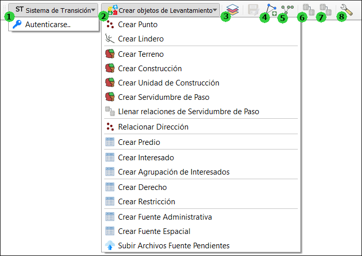

# Barra de herramientas

Así es como se ve la barra de herramientas:

Si la barra de herramientas no aparece en la interfaz de QGIS, puedes hacer que se vea
con la siguiente interacción: click derecho en la región gris en QGIS y clickeando
en "Herramientas LADM-COL" o como en el siguiente gif:

## Construir linderos

## Mover nodos

## Llenar PuntosCCL

Puedes llenar la tabla de topología PuntosCCL usando el botón Llenar PuntosCCL en la barra
de herramientas de LADM_COL el cual hace este trabajo de forma automática y más rápido.

Estas son las tablas que se relacionan con esta función:
- puntosccl –> puntolindero y lindero

## Llenar más y menos CCL

Puedes llenar la tabla de topología más CCL y menos usando el botón Llenar más CCL y menos
usando la barra de herramientas de LADM_COL el cual hace este trabajo de forma automática y más rápido.

Estas son las tablas que se relacionan con esta función:

- masccl –> terreno y lindero
- menos –> terreno y lindero (agujeros o anillos internos)

## Llenar relaciones de Servidumbre de paso

Debes seleccionar una **Servidumbre de Paso**, uno o más **Terreno(s)** que serán beneficiados
con la servidumbre de paso, y una o más **Fuentes Administrativa(s)** que soporte(n) la servidumbre de paso.
El plugin automáticamente crea la relación entre los predios beneficados y las relaciones.
Es importante saber que debes tener las relaciones entre los predios y
los terrenos para evitar inconvenientes con esta función.

